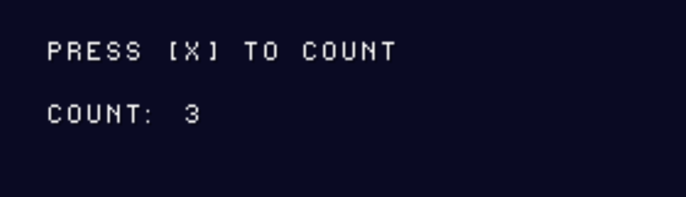

# Tutorial 5 — Signals

## Why Signals?

Without signals, a node that wants to notify another node about an event needs a
direct pointer to it:

```c
// Tight coupling — the gem knows about the score counter
static void gem_update(Node *self, int dt)
{
    if (overlapping) {
        score_counter_add(g_score_node, 1);   // direct call
        node_free(self);
    }
}
```

This works, but it ties the gem's implementation to the score counter's API.
Signals invert the dependency: the gem _emits_ an event; anything that cares
_connects_ to it.

```c
// Decoupled — gem doesn't know who listens
static void gem_update(Node *self, int dt)
{
    if (overlapping) {
        signal_emit(SIGNAL_BODY_ENTERED, self, NULL);
        node_free(self);
    }
}
```

---

## The Connection Table

All connections are stored in a single flat array of 64 `Connection` structs in
`signal.c`:

```c
// engine/core/signal.h
typedef struct {
    uint32_t      signal_id;  // which signal
    Node         *emitter;    // who sends it (NULL = match any sender)
    Node         *target;     // who receives it
    SignalCallback callback;  // void (*)(Node *emitter, void *args)
    int           active;     // 0 = free slot
} Connection;
```

The table has room for **64 connections**. It is reset (all slots cleared) on
every `scene_change`. Connections do **not** survive a scene transition — always
wire them up in your factory or `init` callback.

---

## Connecting

```c
int slot = signal_connect(
    signal_id,   // which signal to listen for
    emitter,     // Node* whose emissions to filter on (NULL = any node)
    target,      // Node* that will receive the callback
    callback     // void (*)(Node *emitter, void *args)
);
// Returns the slot index (0..63) or -1 if the table is full.
```

`emitter` can be `NULL` to receive the signal from any node that emits it.

---

## Emitting

```c
signal_emit(signal_id, emitter_node, args_ptr);
```

`signal_emit` walks the entire 64-slot table and fires the callback on every
active connection where:

- `connection.signal_id == signal_id`, **and**
- `connection.emitter == emitter_node` (or `connection.emitter == NULL`)

`args` is an untyped `void *`. The sender and receiver agree on the type by
convention — cast inside the callback.

---

## Disconnecting

```c
signal_disconnect_all(node);
```

Clears every slot in the table where `connection.emitter == node` **or**
`connection.target == node`. Typed nodes (`collision_shape`, `audio_player`,
etc.) call this automatically in their `destroy` callback. For BASE nodes, call
it in your own `destroy` if needed.

---

## Predefined Signal IDs

| Constant               | Value    | Intended use                         |
| ---------------------- | -------- | ------------------------------------ |
| `SIGNAL_BODY_ENTERED`  | `0x0001` | A physics body overlapped this shape |
| `SIGNAL_BODY_EXITED`   | `0x0002` | A physics body stopped overlapping   |
| `SIGNAL_ANIM_FINISHED` | `0x0003` | An animation cycle completed         |
| `SIGNAL_DIED`          | `0x0004` | A node was destroyed by game logic   |
| `SIGNAL_USER`          | `0x0100` | Base value for game-defined signals  |

Define your own signals starting from `SIGNAL_USER`:

```c
#define SIGNAL_SCORED    (SIGNAL_USER + 1)
#define SIGNAL_LEVEL_END (SIGNAL_USER + 2)
```

---

## Callback Signature

Every callback has the same signature:

```c
void my_callback(Node *emitter, void *args);
```

`emitter` is the node that called `signal_emit`. `args` is whatever pointer was
passed as the third argument — cast it to the agreed-upon type:

```c
typedef struct { int value; } ScoreArgs;

static void on_scored(Node *emitter, void *args)
{
    ScoreArgs *a = (ScoreArgs *)args;
    s_score += a->value;
    FntPrint(-1, "Score: %d (+%d)", s_score, a->value);
    (void)emitter;
}
```

---

## Checkpoint — Button and Counter

Two nodes: a **Button** that emits `SIGNAL_USER+1` each time X is pressed, and a
**Counter** that receives it and increments a displayed score.

```c
// checkpoint_signals.c
#include <psxpad.h>
#include <psxetc.h>
#include "engine/engine.h"

static char      s_pad_buf[2][34];
static SceneTree s_scene;
SceneTree       *g_scene    = &s_scene;
unsigned short   g_pad_btns = 0xFFFF;
unsigned short   g_pad_prev = 0xFFFF;
#define BTN_TAPPED(b) ((g_pad_prev & (b)) && !(g_pad_btns & (b)))

#define SIGNAL_BUTTON_PRESSED (SIGNAL_USER + 1)

/* ── Counter node state ─────────────────────────────────────────────────────── */
static int s_count = 0;

static void on_button_pressed(Node *emitter, void *args)
{
    (void)emitter; (void)args;
    s_count++;
}

static void counter_draw(Node *self)
{
    (void)self;
    FntPrint(-1, "\n\n  Count: %d", s_count);
}

/* ── Button node ────────────────────────────────────────────────────────────── */
static void button_update(Node *self, int dt)
{
    (void)dt;
    if (BTN_TAPPED(PAD_CROSS))
        signal_emit(SIGNAL_BUTTON_PRESSED, self, NULL);
}

static void button_draw(Node *self)
{
    (void)self;
    FntPrint(-1, "\n  Press [X] to count\n");
}

/* ── Factory ────────────────────────────────────────────────────────────────── */
static Node *my_factory(SceneTree *tree)
{
    Node *root    = node_alloc(NODE_TYPE_BASE, "Root");

    Node *button  = node_alloc(NODE_TYPE_BASE, "Button");
    button->update = button_update;
    button->draw   = button_draw;
    node_add_child(root, button);

    Node *counter = node_alloc(NODE_TYPE_BASE, "Counter");
    counter->draw  = counter_draw;
    node_add_child(root, counter);

    // Wire: when button emits SIGNAL_BUTTON_PRESSED, call on_button_pressed
    // on counter.
    signal_connect(SIGNAL_BUTTON_PRESSED, button, counter, on_button_pressed);

    (void)tree;
    return root;
}

/* ── main ───────────────────────────────────────────────────────────────────── */
int main(void)
{
    engine_init();
    InitPAD(s_pad_buf[0], 34, s_pad_buf[1], 34);
    StartPAD();
    ChangeClearPAD(0);

    scene_tree_init(g_scene);
    scene_change(g_scene, my_factory);

    while (1) {
        PADTYPE *pad = (PADTYPE *)s_pad_buf[0];
        g_pad_prev = g_pad_btns;
        g_pad_btns = 0xFFFF;
        if (pad->stat == 0 &&
            (pad->type == 0x4 || pad->type == 0x5 || pad->type == 0x7))
            g_pad_btns = pad->btn;

        scene_update(g_scene, 1);
        engine_renderer_begin_frame();
        scene_draw(g_scene);
        engine_renderer_end_frame();
    }
    return 0;
}
```



---

## Common Pitfalls

**1. Connecting to a node that will be freed**

If the _target_ node is freed before the emitter fires again, the callback
receives a dangling pointer. Either `signal_disconnect_all(target)` before
freeing, or structure your scene so the target outlives the emitter.

**2. Forgetting to reconnect after scene_change**

The connection table is reset on every `scene_change`. If Scene B should listen
to something, connect in Scene B's factory or in the root node's `init`.

**3. Table exhaustion**

64 connections may sound generous but tilemaps with many entities can fill it
quickly if each entity connects several signals. Count your connections and use
`signal_connect`'s return value to detect `-1` (table full) during development.

---

## API Reference

| Function                                  | Description                                                  |
| ----------------------------------------- | ------------------------------------------------------------ |
| `signal_connect(id, emitter, target, cb)` | Add a connection. Returns slot index or `-1` if full.        |
| `signal_emit(id, emitter, args)`          | Fire all matching callbacks synchronously.                   |
| `signal_disconnect_all(node)`             | Remove all connections where node is emitter or target.      |
| `signal_table_init()`                     | Clear all 64 slots (called automatically by `scene_change`). |

---

## What's Next

[Tutorial 6 — 2D Space: Node2D & Camera2D](06-node2d-camera2d.md)

Start the Gem Collector project: place a movable player in 2D space and add a
scrolling camera.
