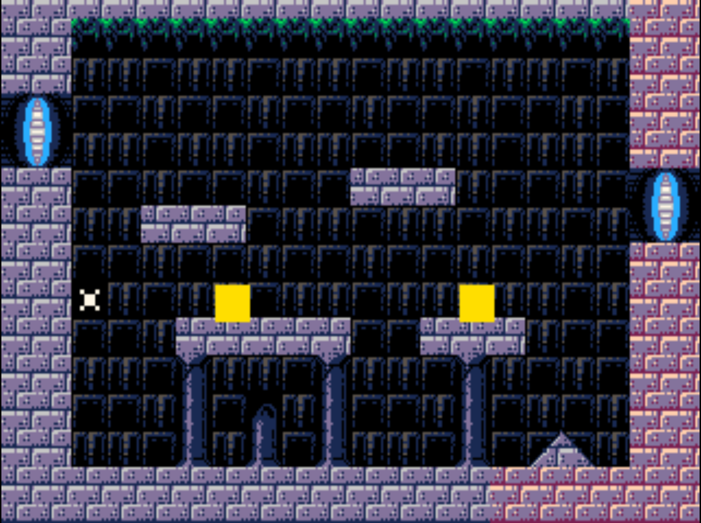

# Tutorial 7 — Rendering: Sprites & TileMaps

_Building on Tutorial 6: replace the player placeholder with a textured Sprite
and add a TileMap background._

---

## Sprite

A `Sprite` node draws a single textured quad (`POLY_FT4`) every frame. It reads
its position from the **nearest Node2D ancestor** in the tree and subtracts the
active camera offset to produce the screen position.

### SpriteData fields

| Field                  | Type          | Description                                          |
| ---------------------- | ------------- | ---------------------------------------------------- |
| `tree`                 | `SceneTree *` | Set by `sprite_create`; used to find `active_camera` |
| `u`, `v`               | `int`         | Top-left texel in the atlas (pixels)                 |
| `w`, `h`               | `int`         | Sprite size in pixels                                |
| `tpage`                | `uint16_t`    | Packed tpage word from `engine_renderer_load_atlas`  |
| `clut`                 | `uint16_t`    | Packed CLUT word; ignored when `use_theme_clut = 1`  |
| `use_theme_clut`       | `int`         | `1` = follow the active theme palette each frame     |
| `z_index`              | `int`         | OT layer — use an `ENGINE_OT_*` constant             |
| `flip_x`               | `int`         | `1` = mirror horizontally                            |
| `use_parent_rot`       | `int`         | `1` = inherit parent Node2D rotation                 |
| `origin_x`, `origin_y` | `int`         | Local draw offset (e.g. `−w/2, −h/2` to centre)      |

### Creating and configuring a Sprite

```c
Node *spr = sprite_create(tree, "PlayerSpr");
SpriteData *sd = (SpriteData *)spr->data;

sd->tpage         = s_tpage;          /* from engine_renderer_load_atlas        */
sd->use_theme_clut = 0;               /* use own CLUT palette        */
sd->u             = 0;                /* UV_PLAYER_X in the geodash spritesheet */
sd->v             = 0;                /* UV_PLAYER_Y                            */
sd->w             = 16;
sd->h             = 16;
sd->z_index       = ENGINE_OT_PLAYER;
sd->use_parent_rot = 0;               /* axis-aligned                           */
sd->origin_x      = 0;               /* top-left of Node2D is top-left of quad */
sd->origin_y      = 0;
```

Add it as a child of the player Node2D:

```c
node_add_child(player_nd_node, spr);
```

The Sprite's `draw()` callback (wired up by `sprite_create`) automatically reads
`player_nd->wx, player_nd->wy` at draw time.

---

## TileMap

A `TileMap` node draws visible tiles as `POLY_FT4` quads into `ENGINE_OT_TILES`.
It culls columns outside `[cam_ox, cam_ox + SCREEN_W]` automatically.

### TileMapData fields

| Field                | Type              | Description                                                         |
| -------------------- | ----------------- | ------------------------------------------------------------------- |
| `tree`               | `SceneTree *`     | For camera lookup                                                   |
| `tiles`              | `const uint8_t *` | Row-major array: `tiles[row * map_w + col]`. Tile `0` = transparent |
| `map_w`, `map_h`     | `int`             | Map dimensions in tiles                                             |
| `tile_size`          | `int`             | Tile size length in pixels                                          |
| `tpage`, `clut`      | `uint16_t`        | Atlas handles                                                       |
| `use_theme_clut`     | `int`             | `1` = follow active theme each frame                                |
| `atlas_u`, `atlas_v` | `int`             | Texel origin of the tile strip in the atlas                         |
| `tiles_per_row`      | `int`             | Tiles per atlas row (0 = horizontal strip only)                     |
| `z_index`            | `int`             | Normally `ENGINE_OT_TILES`                                          |

### Atlas UV calculation

With `tiles_per_row = 0`, tile index `N` maps to atlas column `N`:

```
u = atlas_u + N * tile_size
v = atlas_v
```

With `atlas_u = 0` and the geodash spritesheet:

```
tile 0  → u=0  — transparent (skipped)
tile 1  → u=16 — UV_BLOCK_X = solid block   ← use this for ground
tile 2  → u=32 — UV_PLATFORM_X = platform
```

### Creating and configuring a TileMap

```c
/* Parent the TileMap to a Node2D at (0, 0) to set its world origin */
Node *map_nd = node2d_create("MapOrigin");  /* world position = (0, 0) */

Node *map = tilemap_create(tree, "Map");
TileMapData *tm = (TileMapData *)map->data;

tm->tiles         = s_map_data;  /* pointer to your static uint8_t array */
tm->map_w         = GC_MAP_W;    /* 40 */
tm->map_h         = GC_MAP_H;    /* 12 */
tm->tile_size     = GC_TILE_SIZE;/* 16 */
tm->tpage         = s_tpage;
tm->use_theme_clut = 0;
tm->atlas_u       = 0;
tm->atlas_v       = 0;
tm->tiles_per_row = 0;           /* horizontal strip: tile N → column N */
tm->z_index       = ENGINE_OT_TILES;

node_add_child(map_nd, map);
node_add_child(root, map_nd);
```

---

## Loading the Atlas

Call `engine_renderer_load_atlas` once in `main()` after `engine_init()`:

```c
extern const uint32_t _binary_SPRITES_TIM[];  /* from psn00bsdk_target_incbin */

static uint16_t s_tpage;  /* store globally so factories can read it */

int main(void) {
    engine_init();
    s_tpage = engine_renderer_load_atlas(_binary_SPRITES_TIM);
    ...
}
```

`engine_renderer_load_atlas` uploads the TIM pixel data and CLUT to VRAM and
returns the packed `tpage` word. With `use_theme_clut = 1` on your sprites and
tilemap, `CLUT` is sourced from the active theme automatically — you don't need
to track the CLUT word separately.

---

## API Reference

| Function                               | Description                                          |
| -------------------------------------- | ---------------------------------------------------- |
| `sprite_create(tree, name)`            | Allocate a Sprite node + data.                       |
| `tilemap_create(tree, name)`           | Allocate a TileMap node + data.                      |
| `engine_renderer_load_atlas(tim_data)` | Upload TIM to VRAM, return `tpage`.                  |
| `engine_renderer_active_clut()`        | Packed CLUT word for the current theme.              |
| `engine_render_alloc_prim(size)`       | Reserve bytes in the prim buffer (for manual draws). |
| `engine_render_ot(layer)`              | OT entry pointer for `addPrim()`.                    |

---

## Checkpoint — Gem Collector: Sprites & TileMap

Changes from Tutorial 6:

- `s_tpage` loaded in `main()`
- Player `draw` logic removed from root; **Sprite child** draws the player
- `MapOrigin` Node2D + **TileMap** added
- Gem positions stored (drawn as yellow TILE placeholders in `gc_draw`)

```c
/* Auto-generated by tiled_export.py */
/* Source: world1.json */
/* gc_map.h */
#ifndef GC_MAP_H
#define GC_MAP_H

#include <stdint.h>

/* Map dimensions */
#define GC_MAP_W         20
#define GC_MAP_H         15
#define GC_TILE_SIZE     16
#define GC_TILES_PER_ROW 16

/* World pixel size of the full map */
#define GC_MAP_PX_W  (GC_MAP_W  * GC_TILE_SIZE)
#define GC_MAP_PX_H  (GC_MAP_H  * GC_TILE_SIZE)

/* Tile layer: 'Tile Layer 1' */
static const uint8_t GC_TILE_LAYER_1_tiles[GC_MAP_H * GC_MAP_W] = {
      3,   3,   3,   3,   3,   3,   3,   3,   3,   3,    3,   3,   3,   3,   3,   3,   3,   3,  51,  51,  /* row 0 */
      3,   3,  62,  62,  62,  62,  62,  62,  62,  62,   62,  62,  62,  62,  62,  62,  62,  62,  51,  51,  /* row 1 */
      3,   3,   2,   2,   1,   2,   2,   1,   2,   2,    1,   2,   2,   1,   2,   2,   1,   2,  51,  51,  /* row 2 */
      8,   7,   1,   1,   2,   1,   1,   2,   1,   1,    2,   1,   1,   2,   1,   1,   2,   1,  51,  51,  /* row 3 */
     24,  23,   2,   2,   1,   2,   2,   1,   2,   2,    1,   1,   2,   2,   1,   2,   2,   1,  51,  51,  /* row 4 */
      3,   3,   1,   1,   2,   1,   1,   2,   1,   1,    3,   3,   3,   2,   1,   1,   2,   1,   8,   7,  /* row 5 */
      3,   3,   2,   2,   3,   3,   3,   1,   2,   2,    1,   2,   2,   1,   2,   2,   1,   2,  24,  23,  /* row 6 */
      3,   3,   1,   1,   2,   1,   1,   2,   1,   1,    2,   1,   1,   2,   1,   1,   2,   1,  51,  51,  /* row 7 */
      3,   3,   2,   2,   1,   2,   2,   1,   2,   2,    1,   2,   2,   1,   2,   2,   1,   2,  51,  51,  /* row 8 */
      3,   3,   1,   1,   2,   3,   3,   3,   3,   3,    1,   1,   3,   3,   3,   2,   1,   1,  51,  51,  /* row 9 */
      3,   3,   2,   2,   1,  37,   2,   2,   1,  37,    2,   2,   1,  37,   2,   1,   2,   1,  51,  51,  /* row 10 */
      3,   3,   1,   1,   2,  35,   1,  38,   2,  35,    1,   1,   2,  35,   1,   2,   1,   2,  51,  51,  /* row 11 */
      3,   3,   2,   2,   1,  36,   2,  36,   1,  36,    2,   2,   1,  36,   1,   4,   5,   2,  51,  51,  /* row 12 */
      3,   3,   3,   3,   3,   3,   3,   3,   3,   3,    3,   3,   3,   3,  51,  51,  51,  51,  51,  51,  /* row 13 */
      3,   3,   3,   3,   3,   3,   3,   3,   3,   3,    3,   3,   3,   3,  51,  51,  51,  51,  51,  51,  /* row 14 */
};

#endif /* GC_MAP_H */

// gc_t7_main.c  — adds Sprite + TileMap to the Tutorial 6 checkpoint
#include <psxpad.h>
#include <psxapi.h>
#include <psxgpu.h>
#include "engine/engine.h"
#include "gc_map.h"

/* ── Constants ─────────────────────────────────────────────────────────────── */
#define GC_GROUND_Y (9 * GC_TILE_SIZE) /* y=144 — top of ground  */
#define GC_PLAYER_W 16
#define GC_PLAYER_H 16
#define GC_PLAYER_START_X 32
#define GC_PLAYER_START_Y (GC_GROUND_Y - GC_PLAYER_H) /* 128 */
#define GC_PLAYER_SPEED INT_TO_FIXED(2)
#define GC_GEM_COUNT 2

/* Gem world positions (evenly spaced, sitting on ground) */
static const int s_gem_world_x[GC_GEM_COUNT] = {96, 208};
static const int s_gem_world_y = GC_GROUND_Y - GC_TILE_SIZE; /* 128 */

/* ── Globals ────────────────────────────────────────────────────────────────── */
static char s_pad_buf[2][34];
static SceneTree s_scene;
SceneTree *g_scene = &s_scene;
unsigned short g_pad_btns = 0xFFFF;
unsigned short g_pad_prev = 0xFFFF;
#define BTN_HELD(b) (!(g_pad_btns & (b)))

static TextureResource s_tileset; /* loaded in main() via texture_resource_from_tim */

/* ── Scene state ────────────────────────────────────────────────────────────── */
static Node2DData *s_player_nd;
static Node *s_player_node;
static Camera2DData *s_cam_data;

/* ── Scene callbacks ────────────────────────────────────────────────────────── */
static void gc_update(Node *self, int dt)
{
    int i, scroll;
    (void)self;
    (void)dt;

    if (BTN_HELD(PAD_RIGHT))
        s_player_nd->x += GC_PLAYER_SPEED;
    if (BTN_HELD(PAD_LEFT))
        s_player_nd->x -= GC_PLAYER_SPEED;
    if (s_player_nd->x < 0)
        s_player_nd->x = 0;
    if (s_player_nd->x > INT_TO_FIXED(GC_MAP_PX_W - GC_PLAYER_W))
        s_player_nd->x = INT_TO_FIXED(GC_MAP_PX_W - GC_PLAYER_W);

    node2d_update_world_transform(s_player_node);

    scroll = s_player_nd->wx - ENGINE_SCREEN_W / 2;
    if (scroll < 0)
        scroll = 0;
    if (scroll > GC_MAP_PX_W - ENGINE_SCREEN_W)
        scroll = GC_MAP_PX_W - ENGINE_SCREEN_W;
    s_cam_data->ox = scroll;
}

static void gc_draw(Node *self)
{
    int i;
    (void)self;

    /* Draw gem placeholders as yellow 12×12 tiles */
    for (i = 0; i < GC_GEM_COUNT; i++)
    {
        int sx = s_gem_world_x[i] - s_cam_data->ox + 2;
        int sy = s_gem_world_y + 2;
        TILE *t = (TILE *)engine_render_alloc_prim(sizeof(TILE));
        setTile(t);
        setXY0(t, (short)sx, (short)sy);
        setWH(t, 12, 12);
        setRGB0(t, 255, 220, 0); /* yellow */
        addPrim(engine_render_ot(ENGINE_OT_OBJ), t);
    }
}

/* ── Factory ────────────────────────────────────────────────────────────────── */
static Node *gc_factory(SceneTree *tree)
{
    Node *root = node_alloc(NODE_TYPE_BASE, "GCRoot");
    root->update = gc_update;
    root->draw = gc_draw;

    /* TileMap — parented to a Node2D at (0, 0) for world-space origin */
    Node *map_nd = node2d_create("MapOrigin");
    Node *map = tilemap_create(tree, "Map");
    TileMapData *tm = (TileMapData *)map->data;
    tm->tiles = GC_TILE_LAYER_1_tiles;
    tm->map_w = GC_MAP_W;
    tm->map_h = GC_MAP_H;
    tm->tile_size = GC_TILE_SIZE;
    tm->tpage = s_tileset.tpage;
    tm->clut = s_tileset.clut_word;
    tm->use_theme_clut = 0;
    tm->atlas_u = 0; /* tile N → atlas x = 0 + N*16 */
    tm->atlas_v = 0;
    tm->tiles_per_row = GC_TILES_PER_ROW; /* horizontal strip */
    tm->z_index = ENGINE_OT_TILES;
    node_add_child(map_nd, map);
    node_add_child(root, map_nd);

    /* Player Node2D */
    Node *player = node2d_create("Player");
    s_player_node = player;
    s_player_nd = (Node2DData *)player->data;
    s_player_nd->x = INT_TO_FIXED(GC_PLAYER_START_X);
    s_player_nd->y = INT_TO_FIXED(GC_PLAYER_START_Y);

    /* Player Sprite — child of Player Node2D */
    Node *spr = sprite_create(tree, "PlayerSpr");
    SpriteData *sd = (SpriteData *)spr->data;
    sd->tpage = s_tileset.tpage;
    sd->use_theme_clut = 1;
    sd->u = 0; /* UV_PLAYER_X: player texture at atlas x=0 */
    sd->v = 0; /* UV_PLAYER_Y */
    sd->w = GC_PLAYER_W;
    sd->h = GC_PLAYER_H;
    sd->z_index = ENGINE_OT_PLAYER;
    sd->use_parent_rot = 0;
    node_add_child(player, spr);
    node_add_child(root, player);

    /* Camera2D — no Node2D parent, purely offset-driven */
    Node *cam = camera2d_create(tree, "Camera");
    s_cam_data = (Camera2DData *)cam->data;
    node_add_child(root, cam);

    return root;
}

/* ── Incbin symbol ──────────────────────────────────────────────────────────── */
extern const uint32_t _binary_TILESET_TIM[];

/* ── main ───────────────────────────────────────────────────────────────────── */
int main(void)
{
    engine_init();
    texture_resource_from_tim(_binary_TILESET_TIM, &s_tileset);

    InitPAD(s_pad_buf[0], 34, s_pad_buf[1], 34);
    StartPAD();
    ChangeClearPAD(0);

    scene_tree_init(g_scene);
    scene_change(g_scene, gc_factory);

    while (1)
    {
        // 1. Read pad (see above) — do this first so scene nodes see fresh input
        PADTYPE *pad = (PADTYPE *)s_pad_buf[0];
        g_pad_prev = g_pad_btns;
        g_pad_btns = 0xFFFF;
        if (pad->stat == 0 &&
            (pad->type == 0x4 || pad->type == 0x5 || pad->type == 0x7))
            g_pad_btns = pad->btn;

        // 2. Update all scene logic (calls every active node's update callback)
        scene_update(g_scene, 1);

        // 3. Swap and clear the prim buffer, clear the OT
        engine_renderer_begin_frame();

        // 4. Draw all scene nodes (populates OT + prim buffer)
        scene_draw(g_scene);

        // 5. FntFlush → DrawSync(0) → VSync(0) → swap display/draw buffers
        engine_renderer_end_frame();
    }

    return 0;
}
```

---

## Building a Level with Tiled

So far `gc_map.h` has been written by hand. This section replaces that with a
real workflow: design the level in **Tiled**, export it as JSON, and generate
the header automatically with `tiled_export.py`.

### 1. Prepare the tileset image

Create `tileset.png` — a horizontal strip of 16×16 tiles. Each column is one
tile type. Leave column 0 empty (transparent): the engine always treats index 0
as "skip this tile", so your usable tiles start at index 1.

Example 8-tile strip (128×16 px):

```
col: 0      1      2      3      4      5      6      7
    [empty][grass][stone][dirt ][sky  ][water][lava ][ice  ]
      ↑
      index 0 = transparent, always skipped by TileMap
```

Convert to TIM with `img2tim` (part of PSn00bSDK):

```
img2tim -bpp 4 -org 640 0 -plt 0 480 -o tileset.tim tileset.png
```

- `-org 640 0` — place pixel data in VRAM at x=640, y=0 (past the two
  framebuffers)
- `-plt 0 480` — place the 16-colour CLUT at VRAM x=0, y=480
- `-bpp 4` — 4-bit indexed colour (16 colours, one CLUT row)

Add `tileset.tim` to `iso.xml` so it ends up on the CD image, and register it as
an `incbin` in `CMakeLists.txt`:

```cmake
psn00bsdk_target_incbin(mygame PRIVATE _binary_TILESET_TIM tileset.tim)
```

### 2. Create the map in Tiled

1. **New Map** — orientation: Orthogonal, tile size: 16×16, map size: 20×15
   tiles (320×240 px — exactly one screen wide to start)
2. **New Tileset** — source: `tileset.png`, tile width/height: 16, spacing: 0,
   margin: 0, embed in map
3. Paint tiles. Column 0 in Tiled's tileset panel = engine index 1 (grass),
   column 1 = engine index 2 (stone), etc.
4. **File → Export As → JSON map files** → save as `world1.json`

> **Key Tiled setting**: in the tileset properties, set **Columns** to the
> number of tiles in your strip (e.g. 8). `tiled_export.py` reads this value
> directly as `tiles_per_row`.

### 3. Run tiled_export.py

```
python tools/tiled_export.py world1.json --prefix GC --output src/gc_map.h
```

The script reads every tile layer in `world1.json` and emits one `uint8_t` array
per layer. For a map with a single layer named `"Tile Layer 1"` it produces
`src/gc_map.h` containing:

```c
/* Auto-generated by tiled_export.py */
#ifndef GC_MAP_H
#define GC_MAP_H

#include <stdint.h>

/* Map dimensions */
#define GC_MAP_W          20
#define GC_MAP_H          10
#define GC_TILE_SIZE      16
#define GC_TILES_PER_ROW   8

/* World pixel size of the full map */
#define GC_MAP_PX_W  (GC_MAP_W * GC_TILE_SIZE)
#define GC_MAP_PX_H  (GC_MAP_H * GC_TILE_SIZE)

/* Tile layer: 'Tile Layer 1' */
static const uint8_t GC_TILE_LAYER_1_tiles[GC_MAP_H * GC_MAP_W] = {
      0,  0,  0,  0,  0,  0,  0,  0,  0,  0,  /* row 0 */
    ...
      1,  1,  1,  1,  1,  1,  1,  1,  1,  1,  /* row 9 */
};

#endif /* GC_MAP_H */
```

**GID mapping**: Tiled stores tile IDs as GIDs (1-based, with `firstgid`
offset). The script converts them: `engine_index = GID - firstgid + 1`. So Tiled
tile 0 (first slot in your tileset) → engine index 1 → atlas column 1. Tiled's
empty cell (GID 0) → engine index 0 → skipped by TileMap.

> If you rename the layer in Tiled (e.g. to `"Background"`), the generated array
> will be `GC_BACKGROUND_tiles`. Update the `tm->tiles` assignment in your
> factory accordingly.

### 4. Wire the generated header into the scene

`#include "gc_map.h"` is already at the top of `main.c`. The factory uses the
generated constants directly:

```c
tm->tiles         = GC_TILE_LAYER_1_tiles;  /* array from gc_map.h        */
tm->map_w         = GC_MAP_W;
tm->map_h         = GC_MAP_H;
tm->tile_size     = GC_TILE_SIZE;
tm->tpage         = s_tileset.tpage;        /* from texture_resource_from_tim */
tm->clut          = s_tileset.clut_word;    /* tileset's own CLUT             */
tm->use_theme_clut = 0;
tm->atlas_u       = 0;
tm->atlas_v       = 0;
tm->tiles_per_row = GC_TILES_PER_ROW;      /* columns in tileset.png         */
tm->z_index       = ENGINE_OT_TILES;
```

Load the tileset in `main()` using `texture_resource_from_tim` (not
`engine_renderer_load_atlas`) so the CLUT word is captured alongside the tpage:

```c
extern const uint32_t _binary_TILESET_TIM[];
static TextureResource s_tileset;

int main(void) {
    engine_init();
    texture_resource_from_tim(_binary_TILESET_TIM, &s_tileset);
    ...
}
```

> **Why not `use_theme_clut = 1`?** The theme CLUT points at the engine's
> built-in palette (uploaded by `engine_renderer_init`). Your tileset has its
> own 16-colour palette embedded in the TIM. Using `use_theme_clut = 1` would
> apply the wrong colours. Set `use_theme_clut = 0` and assign
> `s_tileset.clut_word` to `tm->clut`.

### 5. Iterating on the level

The full edit loop is:

1. Edit tiles in Tiled
2. Re-export: **File → Export As** (overwrites `world1.json`)
3. Re-run:
   `python tools/tiled_export.py world1.json --prefix GC --output src/gc_map.h`
4. `cmake --build ./build`

No C code changes needed between iterations — only the data in `gc_map.h`
changes.

</img>

---

## What's Next

[Tutorial 8 — Physics & Collision](08-physics.md)

Add sensor `CollisionShape` nodes to the gems and use `physics_query_aabb` to
detect overlaps and collect them.
